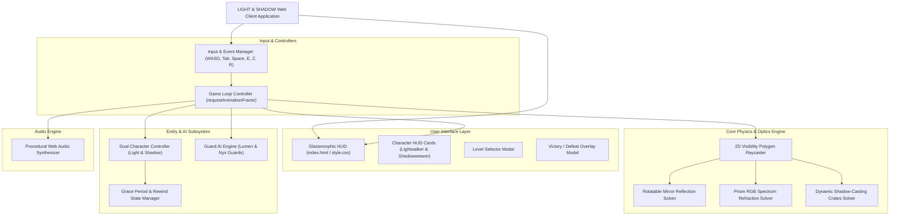

# Supporting File: System Architecture Diagram

```mermaid
graph TD
    Client["LIGHT & SHADOW Web Client Application"]

    subgraph User Interface Layer
        HUD["Glassmorphic HUD (index.html / style.css)"]
        CharCards["Character HUD Cards (Lightwalker & Shadowweaver)"]
        LevelModal["Level Selector Modal"]
        Overlay["Victory / Defeat Overlay Modal"]
    end

    subgraph Input & Controllers
        InputMgr["Input & Event Manager (WASD, Tab, Space, E, Z, R)"]
        GameLoop["Game Loop Controller (requestAnimationFrame)"]
    end

    subgraph Core Physics & Optics Engine
        Raycaster["2D Visibility Polygon Raycaster"]
        Mirrors["Rotatable Mirror Reflection Solver"]
        Prisms["Prism RGB Spectrum Refraction Solver"]
        Crates["Dynamic Shadow-Casting Crates Solver"]
    end

    subgraph Entity & AI Subsystem
        CharController["Dual Character Controller (Light & Shadow)"]
        GraceSystem["Grace Period & Rewind State Manager"]
        GuardAI["Guard AI Engine (Lumen & Nyx Guards)"]
    end

    subgraph Audio Engine
        AudioSynth["Procedural Web Audio Synthesizer"]
    end

    Client --> HUD
    Client --> InputMgr
    InputMgr --> GameLoop
    
    GameLoop --> Raycaster
    Raycaster --> Mirrors
    Raycaster --> Prisms
    Raycaster --> Crates
    
    GameLoop --> CharController
    CharController --> GraceSystem
    GameLoop --> GuardAI
    
    GameLoop --> AudioSynth
    GameLoop --> HUD
```
