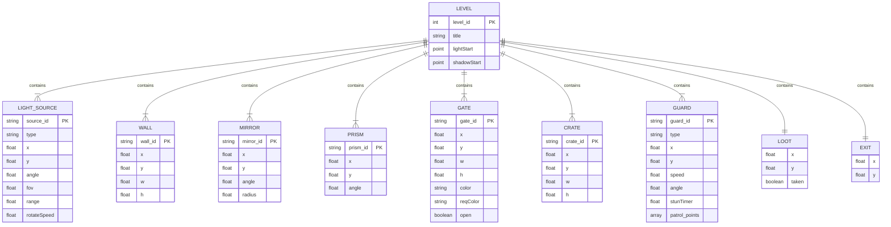

# Supporting File: ER Diagram & Data Schema

```mermaid
erDiagram
    LEVEL ||--|{ LIGHT_SOURCE : contains
    LEVEL ||--|{ WALL : contains
    LEVEL ||--|{ MIRROR : contains
    LEVEL ||--|{ PRISM : contains
    LEVEL ||--|{ GATE : contains
    LEVEL ||--|{ CRATE : contains
    LEVEL ||--|{ GUARD : contains
    LEVEL ||--|| LOOT : contains
    LEVEL ||--|| EXIT : contains

    LEVEL {
        int level_id PK
        string title
        point lightStart
        point shadowStart
    }

    LIGHT_SOURCE {
        string source_id PK
        string type
        float x
        float y
        float angle
        float fov
        float range
        float rotateSpeed
    }

    WALL {
        string wall_id PK
        float x
        float y
        float w
        float h
    }

    MIRROR {
        string mirror_id PK
        float x
        float y
        float angle
        float radius
    }

    PRISM {
        string prism_id PK
        float x
        float y
        float angle
    }

    GATE {
        string gate_id PK
        float x
        float y
        float w
        float h
        string color
        string reqColor
        boolean open
    }

    CRATE {
        string crate_id PK
        float x
        float y
        float w
        float h
    }

    GUARD {
        string guard_id PK
        string type
        float x
        float y
        float speed
        float angle
        float stunTimer
        array patrol_points
    }

    LOOT {
        float x
        float y
        boolean taken
    }

    EXIT {
        float x
        float y
    }
```
