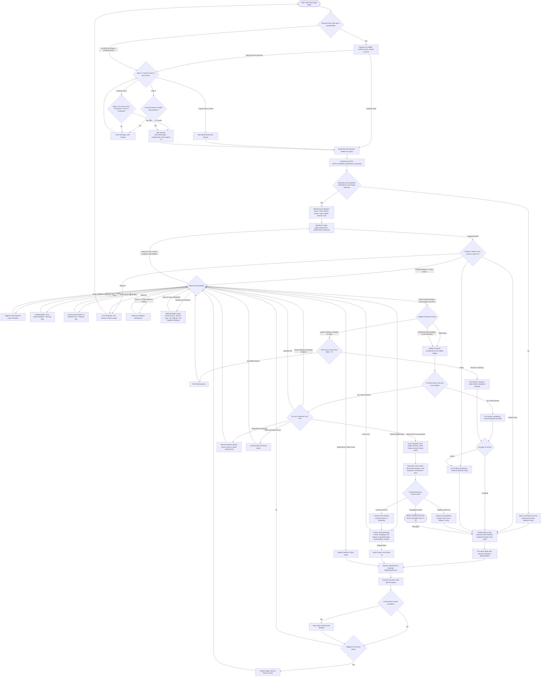

# Supporting File: Flowchart

```mermaid
flowchart TD
    Start(["Open index.html (Login Page)"]) --> HasSession{"Session Exists? (this tab or remembered)"}
    HasSession -- Yes --> ContinueAs["Signed in as NAME: Continue Heist / Switch Account"]
    ContinueAs -- "Switch Account (Log Out)" --> AuthForm
    ContinueAs -- Continue Heist --> GamePage
    HasSession -- "No (First Visit Opens Create Account)" --> AuthForm{"Sign In, Create Account or Quick Play?"}
    AuthForm -- "⚡ Quick Play as Guest" --> GuestSession["Start Ephemeral Guest Session"] --> GamePage
    AuthForm -- Sign In --> ValidateLogin{"Username Exists & Salted Hash Matches?"}
    AuthForm -- Create Account --> ValidateNew{"Name 3-16 chars & Free, Password 4+ chars & Confirmed?"}
    ValidateLogin -- No --> AuthError["Error Message, Card Shakes"] --> AuthForm
    ValidateNew -- No --> AuthError
    ValidateNew -- "Yes (Store Salt + Hash)" --> StartSession
    ValidateLogin -- Yes --> StartSession["Start Session (sessionStorage, + localStorage if Stay Signed In)"]
    StartSession --> GamePage["game.html (No Session? Redirect to Login)"]
    GamePage --> LoadSave["Load Account Save (LIGHT_SHADOW_SAVEDATA::username)"]
    LoadSave --> SnapCheck{"Valid Mid-Level Snapshot? (Unlocked & Level Shape Matches)"}
    SnapCheck -- Yes --> RestoreSnap["Restore Exact Situation (Souls, Timer, Mirrors, Crates, Gates, Plates, Guards, Loot)"]
    RestoreSnap --> Paused["PAUSED Overlay (WELCOME BACK, NAME! after a Resume)"]
    SnapCheck -- No --> PickLevel["Open Last Mission (or First Unfinished) & Show Welcome Toast"]
    PickLevel --> InitEngine["Initialize Map & Light Sources (Fresh Attempt: Snapshot Cleared, Intro Card)"]
    InitEngine --> PreCache["Pre-cache Static Wall Raycast Segments (Optimization)"]
    PreCache --> CastRays[Raycast Light Beams & Calculate Reflections/Prisms]
    CastRays --> BakePolygon[Construct Dynamic Light Mesh Polygons]
    
    BakePolygon --> ReceptorCheck{"Colour Band on Gate Receptor?"}
    ReceptorCheck -- No --> PlateCheck{"Stepped on Pressure Plate?"}
    ReceptorCheck -- Yes --> OpenGate["Open Gate (Latched until Restart)"]
    OpenGate --> PlateCheck
    PlateCheck -- Yes --> ActuatePlateGate["Unlatch Target Gate via Pressure Plate"] --> InputLoop{Player Input Received?}
    PlateCheck -- No --> InputLoop
    
    InputLoop -- Swap Character --> SwitchChar["Toggle Control between Light & Shadow"]
    SwitchChar --> InputLoop

    InputLoop -- "Story Briefing (📜 Button / I Key)" --> BriefingModal["Briefing Modal: Sol & Umbra Dialogue + Security Intel"]
    BriefingModal -- "Begin Infiltration / Esc" --> InputLoop
    InputLoop -- "Trophies (🏆 Button)" --> AchievementsModal["Achievements Modal: 10 Trophies Grid + Progress Bar"]
    AchievementsModal -- "Close / Esc" --> InputLoop
    InputLoop -- "Workshop (🛠️ Button)" --> EditorModal["Custom Heist Workshop: Canvas Snapping, Tool Palette, Drag Walls/Gates, Export/Import, Playtest"]
    EditorModal -- "Playtest Heist" --> PlaytestInit["Load Custom Level (index -1)"] --> CastRays
    EditorModal -- "Close / Esc" --> InputLoop

    InputLoop -- "Pause (P / Esc / Pause Button) or Tab Hidden" --> Paused
    Paused -- "Snapshot Saved" --> PausedChoice{"Continue, Restart Level, Levels or Sign Out?"}
    PausedChoice -- "Continue (Button / P / Esc / Enter)" --> InputLoop
    PausedChoice -- Restart Level --> InitEngine
    PausedChoice -- Levels --> LevelSelect
    PausedChoice -- Sign Out --> SignOut
    InputLoop -- "Every 2 s / Page Hidden or Closed" --> Autosave["Autosave Snapshot (inProgress)"] --> InputLoop
    InputLoop -- "Settings (Gear Button)" --> SettingsModal["Settings Modal: Game Frozen (Touch, Joystick Type, Tilt, Calibrate, Left-Handed, Vibration)"]
    SettingsModal -- "Close (X / Esc / Backdrop)" --> InputLoop
    InputLoop -- Sign Out --> SignOut["Save Snapshot, End Session, Fade to Login"] --> Start
    
    InputLoop -- Rotate Mirror / Move Crate --> UpdateOptics[Update Obstacle / Mirror Angle]
    UpdateOptics --> CastRays
    
    InputLoop -- "Move Character (Keys, else Joystick, else Tilt)" --> CheckBounds{Validate Character Position}
    
    CheckBounds -- Valid Terrain --> UpdatePos["Update Character Coordinates (Grace Meter Refills)"]
    CheckBounds -- "Inside Exit Portal (Twilight: No Terrain Rule)" --> UpdatePos
    CheckBounds -- Light on Shadow / Shadow on Light --> GraceCheck{"Active Soul's Own Grace Meter > 0?"}
    GraceCheck -- "Yes (Meter Drains)" --> ShowWarn[Flash Warning Aura] --> InputLoop
    GraceCheck -- "No (0.5 s Used Up)" --> TriggerFail["Fail Overlay: Caught in Invalid Terrain (Snapshot Cleared)"]
    
    UpdatePos --> CheckGuardVision{"In Guard Vision Cone with Line of Sight?"}
    
    CheckGuardVision -- Yes & Not Stunned --> AlertGuard["Fail Overlay: Spotted by Guard (Snapshot Cleared)"]
    AlertGuard --> RetryChoice{"Try Again or Levels?"}
    TriggerFail --> RetryChoice
    RetryChoice -- Try Again --> InitEngine
    RetryChoice -- Levels --> LevelSelect["Level Select (6 Missions, Unlocked Missions Only)"]
    LevelSelect --> InitEngine
    
    CheckGuardVision -- No / Guard Stunned --> CheckItem{On Loot / Diamond / Exit Tile?}
    
    CheckItem -- "Collect Bonus Diamond" --> CollectDiamond["Diamond Stolen! Update Bonus Count & Check Achievement"] --> InputLoop
    CheckItem -- "Steal Loot (within 30 px)" --> SetLootFlag["Loot Secured! Exit Portal Opens"] --> InputLoop
    CheckItem -- "At Exit without Loot (Portal Sealed)" --> InputLoop
    CheckItem -- Both at Exit & Loot Secured --> LevelWin["Level Complete: Time, Target, Rewinds, Stars, Trophy Checks (Victory Burst)"]
    CheckItem -- Standard Tile --> InputLoop
    
    LevelWin --> SaveProgress["Save Best Time & Stars, Unlock Next Mission, Clear Snapshot, Last Mission = Next"]
    SaveProgress --> FinalCheck{"Final Mission (6) or Custom Heist?"}
    FinalCheck -- "Regular Level (1-5)" --> NextLevel["Mission Accomplished Overlay: Next Level / Replay / Levels"]
    NextLevel --> InitEngine
    FinalCheck -- "Custom Level (-1)" --> CustomWin["Custom Heist Cleared Overlay: Return to Workshop"]
    CustomWin --> EditorModal
    FinalCheck -- "Campaign Final (6)" --> CampaignDone(["HEIST COMPLETE! Heist Total & Campaign Stars X / 18"])
    CampaignDone -- Play Again --> InitEngine
```
