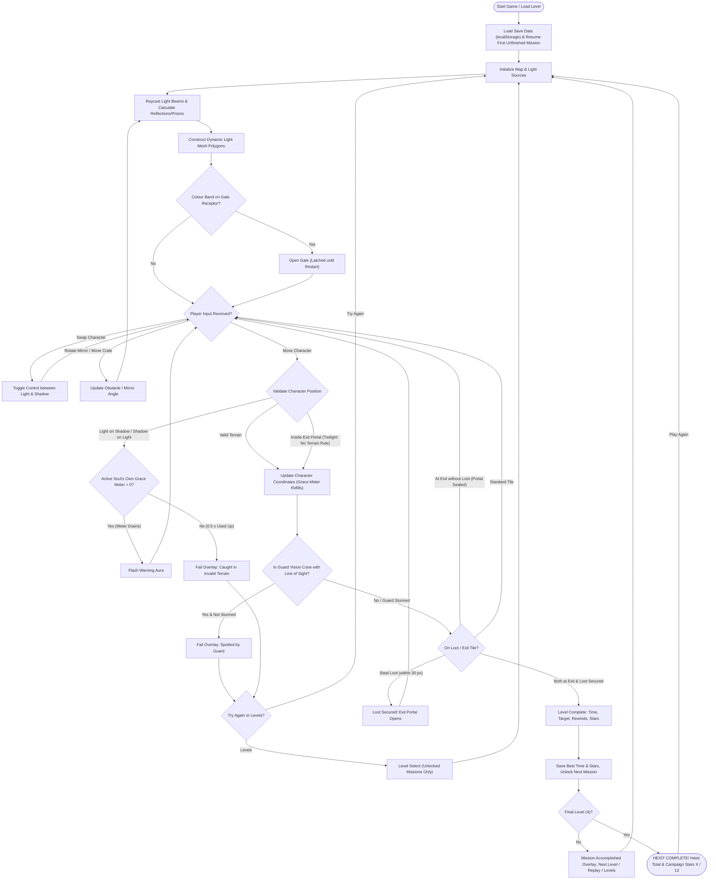

# Supporting File: Flowchart

```mermaid
flowchart TD
    Start([Start Game / Load Level]) --> LoadSave["Load Save Data (localStorage) & Resume First Unfinished Mission"]
    LoadSave --> InitEngine[Initialize Map & Light Sources]
    InitEngine --> CastRays[Raycast Light Beams & Calculate Reflections/Prisms]
    CastRays --> BakePolygon[Construct Dynamic Light Mesh Polygons]
    
    BakePolygon --> ReceptorCheck{"Colour Band on Gate Receptor?"}
    ReceptorCheck -- No --> InputLoop{Player Input Received?}
    ReceptorCheck -- Yes --> OpenGate["Open Gate (Latched until Restart)"]
    OpenGate --> InputLoop
    
    InputLoop -- Swap Character --> SwitchChar[Toggle Control between Light & Shadow]
    SwitchChar --> InputLoop
    
    InputLoop -- Rotate Mirror / Move Crate --> UpdateOptics[Update Obstacle / Mirror Angle]
    UpdateOptics --> CastRays
    
    InputLoop -- Move Character --> CheckBounds{Validate Character Position}
    
    CheckBounds -- Valid Terrain --> UpdatePos["Update Character Coordinates (Grace Meter Refills)"]
    CheckBounds -- "Inside Exit Portal (Twilight: No Terrain Rule)" --> UpdatePos
    CheckBounds -- Light on Shadow / Shadow on Light --> GraceCheck{"Active Soul's Own Grace Meter > 0?"}
    GraceCheck -- "Yes (Meter Drains)" --> ShowWarn[Flash Warning Aura] --> InputLoop
    GraceCheck -- "No (0.5 s Used Up)" --> TriggerFail["Fail Overlay: Caught in Invalid Terrain"]
    
    UpdatePos --> CheckGuardVision{"In Guard Vision Cone with Line of Sight?"}
    
    CheckGuardVision -- Yes & Not Stunned --> AlertGuard["Fail Overlay: Spotted by Guard"]
    AlertGuard --> RetryChoice{"Try Again or Levels?"}
    TriggerFail --> RetryChoice
    RetryChoice -- Try Again --> InitEngine
    RetryChoice -- Levels --> LevelSelect["Level Select (Unlocked Missions Only)"]
    LevelSelect --> InitEngine
    
    CheckGuardVision -- No / Guard Stunned --> CheckItem{On Loot / Exit Tile?}
    
    CheckItem -- "Steal Loot (within 30 px)" --> SetLootFlag["Loot Secured! Exit Portal Opens"] --> InputLoop
    CheckItem -- "At Exit without Loot (Portal Sealed)" --> InputLoop
    CheckItem -- Both at Exit & Loot Secured --> LevelWin["Level Complete: Time, Target, Rewinds, Stars"]
    CheckItem -- Standard Tile --> InputLoop
    
    LevelWin --> SaveProgress["Save Best Time & Stars, Unlock Next Mission"]
    SaveProgress --> FinalCheck{"Final Level (4)?"}
    FinalCheck -- No --> NextLevel["Mission Accomplished Overlay: Next Level / Replay / Levels"]
    NextLevel --> InitEngine
    FinalCheck -- Yes --> CampaignDone(["HEIST COMPLETE! Heist Total & Campaign Stars X / 12"])
    CampaignDone -- Play Again --> InitEngine
```
