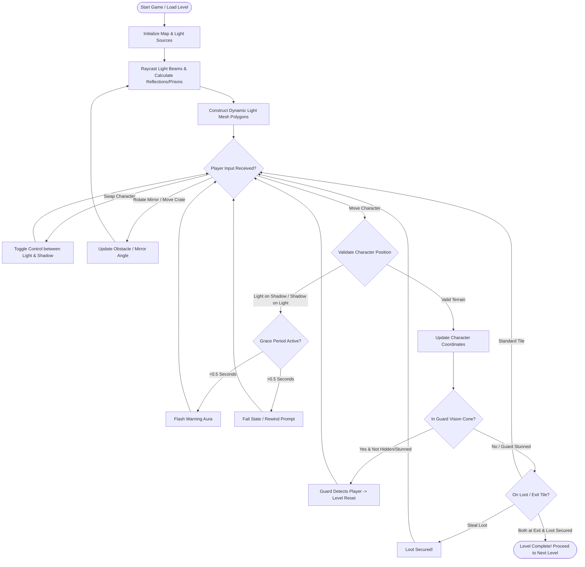

# Supporting File: Flowchart

```mermaid
flowchart TD
    Start([Start Game / Load Level]) --> InitEngine[Initialize Map & Light Sources]
    InitEngine --> CastRays[Raycast Light Beams & Calculate Reflections/Prisms]
    CastRays --> BakePolygon[Construct Dynamic Light Mesh Polygons]
    
    BakePolygon --> InputLoop{Player Input Received?}
    
    InputLoop -- Swap Character --> SwitchChar[Toggle Control between Light & Shadow]
    SwitchChar --> InputLoop
    
    InputLoop -- Rotate Mirror / Move Crate --> UpdateOptics[Update Obstacle / Mirror Angle]
    UpdateOptics --> CastRays
    
    InputLoop -- Move Character --> CheckBounds{Validate Character Position}
    
    CheckBounds -- Light on Shadow / Shadow on Light --> GraceCheck{Grace Period Active?}
    GraceCheck -- <0.5 Seconds --> ShowWarn[Flash Warning Aura] --> InputLoop
    GraceCheck -- >0.5 Seconds --> TriggerFail[Fail State / Rewind Prompt] --> InputLoop
    
    CheckBounds -- Valid Terrain --> UpdatePos[Update Character Coordinates]
    UpdatePos --> CheckGuardVision{In Guard Vision Cone?}
    
    CheckGuardVision -- Yes & Not Hidden/Stunned --> AlertGuard[Guard Detects Player -> Level Reset]
    AlertGuard --> InputLoop
    
    CheckGuardVision -- No / Guard Stunned --> CheckItem{On Loot / Exit Tile?}
    
    CheckItem -- Steal Loot --> SetLootFlag[Loot Secured!] --> InputLoop
    CheckItem -- Both at Exit & Loot Secured --> LevelWin([Level Complete! Proceed to Next Level])
    CheckItem -- Standard Tile --> InputLoop
```
