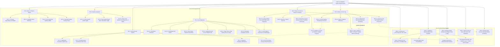

# Supporting File: Requirement Diagram

```mermaid
graph TD
    System["LIGHT & SHADOW System Requirements"]
    
    subgraph Functional Requirements
        FR1["FR-1: Dual Character System"]
        FR1_1["FR-1.1: Lightwalker Constraints (Light only)"]
        FR1_2["FR-1.2: Shadowweaver Constraints (Dark only)"]
        FR1_3["FR-1.3: Character Swapping (Tab/Space)"]
        FR1_4["FR-1.4: Per-Soul Grace Period & Rewind System"]
        
        FR2["FR-2: Optics & Physics Engine"]
        FR2_1["FR-2.1: 2D Light Raycasting & Spotlights"]
        FR2_2["FR-2.2: Rotatable Mirror Reflection"]
        FR2_3["FR-2.3: Prism Spectrum Splitting (RGB)"]
        FR2_4["FR-2.4: Movable Shadow-Casting Crates"]
        
        FR3["FR-3: Stealth & Guard AI"]
        FR3_1["FR-3.1: Lumen Guards (Patrol Light)"]
        FR3_2["FR-3.2: Nyx Guards (Patrol Dark, Stunned by Light)"]
        FR3_3["FR-3.3: Vision Cone Collision Checking (Line of Sight)"]
        
        FR4["FR-4: Level Objectives"]
        FR4_1["FR-4.1: Loot Artifact Collection"]
        FR4_2["FR-4.2: Coordinated Exit Reach"]
        FR4_3["FR-4.3: Level Select, Restart & Unlocking"]
        FR4_4["FR-4.4: Sealed Exit until Loot & Twilight Portal"]
        FR4_5["FR-4.5: Target Time & Star Rating (max 12 stars)"]
        FR4_6["FR-4.6: Campaign Completion Screen"]
        FR4_7["FR-4.7: Local Progress Persistence (localStorage)"]

        FR5["FR-5: Player Accounts & Session Continuity"]
        FR5_1["FR-5.1: Local Accounts with Salted Hashed Passwords"]
        FR5_2["FR-5.2: Multiple Accounts per Device, Isolated Progress"]
        FR5_3["FR-5.3: Continue Where You Left Off (Mid-Level Snapshot)"]
        FR5_4["FR-5.4: Sign Out / Switch Account"]

        FR6["FR-6: Mobile & Touch Play"]
        FR6_1["FR-6.1: Responsive Layout (Scaled Canvas, Portrait & Landscape)"]
        FR6_2["FR-6.2: Touch Joystick & SWAP / ROTATE / UNDO Buttons (Primary)"]
        FR6_3["FR-6.3: Optional Tilt Steering (Calibration, Sensitivity)"]
        FR6_4["FR-6.4: Control Settings Persisted per Account"]
        FR6_5["FR-6.5: Haptic Feedback (Vibration)"]
    end
    
    subgraph Non-Functional Requirements
        NFR1["NFR-1: Performance (<1ms Raycaster, 60+ FPS)"]
        NFR2["NFR-2: Usability & Glassmorphism Noir Aesthetic"]
        NFR2_1["Pause / Resume (P, Esc, Auto-Pause on Hidden Tab)"]
        NFR2_2["Procedural Web Audio Sound Effects"]
        NFR2_3["Feedback Animations (Reduced-Motion Aware)"]
        NFR2_4["No Keyboard Needed, Left-Handed Layout, Thumb-Sized Targets"]
        NFR3["NFR-3: Modular Engine Architecture (Engine / Auth / Login)"]
        NFR4["NFR-4: Static Hosting on Vercel (No Server, No Database)"]
        NFR5["NFR-5: Browser-Only Account Security (Known Limitation)"]
    end

    System --> FR1
    System --> FR2
    System --> FR3
    System --> FR4
    System --> FR5
    System --> FR6
    System --> NFR1
    System --> NFR2
    System --> NFR3
    System --> NFR4
    System --> NFR5
    NFR2 --> NFR2_1
    NFR2 --> NFR2_2
    NFR2 --> NFR2_3
    NFR2 --> NFR2_4

    FR1 --> FR1_1
    FR1 --> FR1_2
    FR1 --> FR1_3
    FR1 --> FR1_4
    
    FR2 --> FR2_1
    FR2 --> FR2_2
    FR2 --> FR2_3
    FR2 --> FR2_4
    
    FR3 --> FR3_1
    FR3 --> FR3_2
    FR3 --> FR3_3
    
    FR4 --> FR4_1
    FR4 --> FR4_2
    FR4 --> FR4_3
    FR4 --> FR4_4
    FR4 --> FR4_5
    FR4 --> FR4_6
    FR4 --> FR4_7

    FR5 --> FR5_1
    FR5 --> FR5_2
    FR5 --> FR5_3
    FR5 --> FR5_4
    FR5_1 -.-> NFR5
    FR5_3 -.-> FR4_7

    FR6 --> FR6_1
    FR6 --> FR6_2
    FR6 --> FR6_3
    FR6 --> FR6_4
    FR6 --> FR6_5
    FR6_2 -.-> FR1_3
    FR6_3 -.->|"joystick overrides tilt"| FR6_2
    FR6_4 -.-> FR5_2
    FR6_2 -.-> NFR2_4
```
