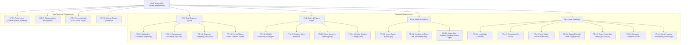

# Supporting File: Requirement Diagram

```mermaid
graph TD
    System["LIGHT & SHADOW System Requirements"]
    
    subgraph Functional Requirements
        FR1["FR-1: Dual Character System"]
        FR1_1["FR-1.1: Lightwalker Constraints (Light only)"]
        FR1_2["FR-1.2: Shadowweaver Constraints (Dark only)"]
        FR1_3["FR-1.3: Character Swapping (Tab/Space)"]
        FR1_4["FR-1.4: Per-Soul Grace Period & Rewind System"]
        
        FR2["FR-2: Optics & Physics Engine"]
        FR2_1["FR-2.1: 2D Light Raycasting & Spotlights"]
        FR2_2["FR-2.2: Rotatable Mirror Reflection"]
        FR2_3["FR-2.3: Prism Spectrum Splitting (RGB)"]
        FR2_4["FR-2.4: Movable Shadow-Casting Crates"]
        
        FR3["FR-3: Stealth & Guard AI"]
        FR3_1["FR-3.1: Lumen Guards (Patrol Light)"]
        FR3_2["FR-3.2: Nyx Guards (Patrol Dark, Stunned by Light)"]
        FR3_3["FR-3.3: Vision Cone Collision Checking (Line of Sight)"]
        
        FR4["FR-4: Level Objectives"]
        FR4_1["FR-4.1: Loot Artifact Collection"]
        FR4_2["FR-4.2: Coordinated Exit Reach"]
        FR4_3["FR-4.3: Level Select, Restart & Unlocking"]
        FR4_4["FR-4.4: Sealed Exit until Loot & Twilight Portal"]
        FR4_5["FR-4.5: Target Time & Star Rating (max 12 stars)"]
        FR4_6["FR-4.6: Campaign Completion Screen"]
        FR4_7["FR-4.7: Local Progress Persistence (localStorage)"]
    end
    
    subgraph Non-Functional Requirements
        NFR1["NFR-1: Performance (<1ms Raycaster, 60+ FPS)"]
        NFR2["NFR-2: Glassmorphism Noir Aesthetic"]
        NFR3["NFR-3: Procedural Web Audio Sound Engine"]
        NFR4["NFR-4: Modular Engine Architecture"]
    end

    System --> FR1
    System --> FR2
    System --> FR3
    System --> FR4
    System --> NFR1
    System --> NFR2
    System --> NFR3
    System --> NFR4

    FR1 --> FR1_1
    FR1 --> FR1_2
    FR1 --> FR1_3
    FR1 --> FR1_4
    
    FR2 --> FR2_1
    FR2 --> FR2_2
    FR2 --> FR2_3
    FR2 --> FR2_4
    
    FR3 --> FR3_1
    FR3 --> FR3_2
    FR3 --> FR3_3
    
    FR4 --> FR4_1
    FR4 --> FR4_2
    FR4 --> FR4_3
    FR4 --> FR4_4
    FR4 --> FR4_5
    FR4 --> FR4_6
    FR4 --> FR4_7
```
