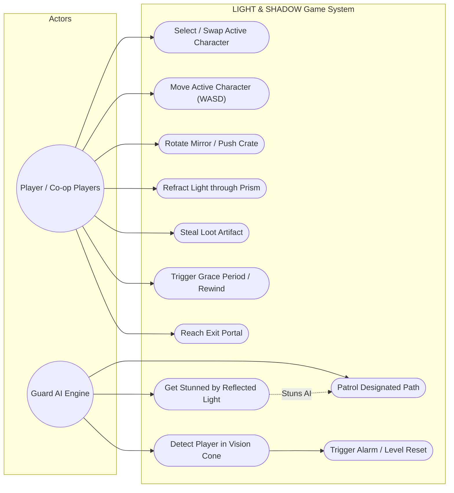

# Supporting File: Use Case Diagram

```mermaid
graph LR
    subgraph Actors
        Player(("Player / Co-op Players"))
        GuardAI(("Guard AI Engine"))
    end
    
    subgraph LIGHT & SHADOW Game System
        UC1(["Select / Swap Active Character"])
        UC2(["Move Active Character (WASD)"])
        UC3(["Rotate Mirror / Push Crate"])
        UC4(["Refract Light through Prism"])
        UC5(["Steal Loot Artifact"])
        UC6(["Trigger Grace Period / Rewind"])
        UC7(["Reach Exit Portal"])
        
        UC8(["Patrol Designated Path"])
        UC9(["Detect Player in Vision Cone"])
        UC10(["Get Stunned by Reflected Light"])
        UC11(["Trigger Alarm / Level Reset"])
    end
    
    Player --> UC1
    Player --> UC2
    Player --> UC3
    Player --> UC4
    Player --> UC5
    Player --> UC6
    Player --> UC7
    
    GuardAI --> UC8
    GuardAI --> UC9
    GuardAI --> UC10
    
    UC9 --> UC11
    UC10 -. Stuns AI .-> UC8
```
